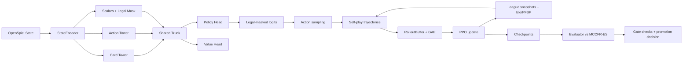

# AntigravityPokerAgent Interview Deep Dive

This document is your complete technical walkthrough of the project.
Use it side-by-side with the code to prepare for detailed interview questions.

Project root used in this guide:
`/Users/sanildesai/Documents/CodeProjects/AntigravityPokerAgent`

---

## 1. What This Project Actually Is

This codebase is a poker RL system inspired by AlphaHoldem-style ideas:
- pseudo-siamese network (card branch + action-history branch),
- on-policy PPO actor-critic training,
- K-best league self-play with PFSP-like opponent sampling,
- solver-generated MCCFR-ES evaluation baseline from OpenSpiel,
- strict evaluation gates before promoting a model.

The practical training target in this repo is **HUNL abstraction**, primarily `fchpa` (fold/call/half-pot/pot/all-in), not unconstrained full betting-space NLHE.

---

## 2. Current Official Result You Should Present

### Canonical interview model
- Checkpoint alias: `interview_ready_1`
- File: `/Users/sanildesai/Documents/CodeProjects/AntigravityPokerAgent/checkpoints/snapshots/interview_ready/interview_ready_1.pt`
- Alias registry: `/Users/sanildesai/Documents/CodeProjects/AntigravityPokerAgent/checkpoints/checkpoint_aliases.json`

### Certified benchmark backing this claim
- Cert JSON: `/Users/sanildesai/Documents/CodeProjects/AntigravityPokerAgent/logs/stage_d/eval/eval_selected_21k_auto_cert_20260216_161321.json`
- Key results (default 5k MCCFR-ES tier):
  - mean: `897.70 bb/100`
  - CI95 lower: `814.95 bb/100`
- Robustness 10k tier CI95 lower: `879.14 bb/100`
- Holdout CI95 lower: `795.18 bb/100`
- `overall/pass_all=true`

### Why the newer 34k branch was **not** promoted
- Screen JSON: `/Users/sanildesai/Documents/CodeProjects/AntigravityPokerAgent/logs/stage_d/eval/eval_longrun_rebalance_34k_screen_20260220_012455.json`
- Gate log: `/Users/sanildesai/Documents/CodeProjects/AntigravityPokerAgent/logs/stage_d/slurm/ah_stage_d_fchpa_gate_check_432657.out`
- It was stable and strong, but CI floor promotion rule failed:
  - default CI95 lower: `747.65 bb/100`
  - required floor: `800`
  - `promotion_pass=False`

Interview framing line:
> "We use strict statistical promotion gates. A later run can be stable and still be rejected if it does not beat the CI floor of the champion."

---

## 3. End-to-End Architecture (Mental Model)

Core training orchestrator:
- `/Users/sanildesai/Documents/CodeProjects/AntigravityPokerAgent/poker_rl_agent/training/trainer.py`

---

## 4. File-by-File Deep Walkthrough

## 4.1 Environment Layer

### `/Users/sanildesai/Documents/CodeProjects/AntigravityPokerAgent/poker_rl_agent/environment/openspiel_wrapper.py`

Purpose:
- safe OpenSpiel wrapper,
- abstraction normalization (`fcpha` alias -> `fchpa`),
- strict HUNL sanity checks.

Key behaviors:
- Resolves abstraction via `_resolve_betting_abstraction`.
- Loads canonical HUNL strings with `pyspiel.hunl_game_string(...)`.
- Special fallback for `fchpa` via parameter-based loading if helper API is inconsistent.
- Hard-fails when `STRICT_ABSTRACTION=true` and requested abstraction is unavailable.
- Validates:
  - `numHoleCards == 2`
  - `numRanks == 13`
  - `numSuits == 4`
  - effective betting abstraction matches expected.

Interview talking point:
- "I added fail-fast abstraction integrity. This prevents silent toy-game fallbacks from invalidating experiments."

### `/Users/sanildesai/Documents/CodeProjects/AntigravityPokerAgent/poker_rl_agent/environment/state_representation.py`

Purpose:
- convert OpenSpiel `state` into model-ready tensors.

Outputs:
- `hole_cards` (2 ints, unknown token 52)
- `community_cards` (5 ints)
- `action_history` (decision-only tokens, chance actions removed)
- `scalars` (11 normalized context values)
- `legal_action_mask`

Important details:
- Uses `state.to_struct()` (not placeholder constants).
- Replays history to remove chance nodes from action sequence.
- Uses padding token `num_actions` for action history.
- Computes normalized pot/stack/contribution and street one-hot.

Interview talking point:
- "The biggest early bug was placeholder state features. Replacing with true structured parsing was the turning point from non-learning to meaningful learning."

---

## 4.2 Model Layer

### `/Users/sanildesai/Documents/CodeProjects/AntigravityPokerAgent/poker_rl_agent/models/card_tower.py`

- Embedding over 53 tokens (52 cards + unknown).
- Flattens 2 hole + 5 board embeddings.
- MLP with LayerNorm/ReLU.

### `/Users/sanildesai/Documents/CodeProjects/AntigravityPokerAgent/poker_rl_agent/models/action_tower.py`

- Embeds action IDs (`num_actions + 1`, last index is padding).
- LSTM over variable-length action histories via packed sequences.
- Final hidden state is action-context representation.

### `/Users/sanildesai/Documents/CodeProjects/AntigravityPokerAgent/poker_rl_agent/models/alpha_holdem_net.py`

Pseudo-siamese design:
- Card branch + action branch + scalar context -> shared trunk.

Outputs:
- `policy_logits` (actor)
- `state_value` (critic)

Important alignment:
- This replaced earlier regret-only output and matches PPO actor-critic direction.

### `/Users/sanildesai/Documents/CodeProjects/AntigravityPokerAgent/poker_rl_agent/models/model_utils.py`

- `masked_logits(...)` forces illegal actions to dtype-safe `-inf` floor.
- prevents illegal-action sampling and mixed-precision overflow issues.

---

## 4.3 Self-Play and On-Policy Data

### `/Users/sanildesai/Documents/CodeProjects/AntigravityPokerAgent/poker_rl_agent/algorithms/self_play.py`

`SelfPlayWorker` responsibilities:
- simulate games with chance nodes,
- alternate training player seat,
- sample actions from policy with optional temperature,
- optionally apply curriculum mask,
- return transitions and terminal reward in BB units.

Important:
- reward is sparse terminal return assigned to last transition.
- this is then shaped by GAE in buffer/trainer.

### `/Users/sanildesai/Documents/CodeProjects/AntigravityPokerAgent/poker_rl_agent/training/rollout_buffer.py`

- stores on CPU for memory efficiency,
- computes GAE advantages + returns,
- pads variable-length histories with action padding token,
- yields PPO minibatches.

### `/Users/sanildesai/Documents/CodeProjects/AntigravityPokerAgent/poker_rl_agent/training/league_manager.py`

- K-best snapshot pool with top-K pruning,
- Elo updates versus sampled opponents,
- PFSP-like sampling probability from ratings.

### `/Users/sanildesai/Documents/CodeProjects/AntigravityPokerAgent/poker_rl_agent/training/action_curriculum.py`

- only used in `fullgame`,
- phase-based raise-cap masking:
  - early: small/capped raises,
  - mid: larger cap,
  - late: full legal space.

---

## 4.4 Trainer (Most Important File)

### `/Users/sanildesai/Documents/CodeProjects/AntigravityPokerAgent/poker_rl_agent/training/trainer.py`

This is the central orchestrator.

Major sections:
1. **Initialization**
- seed control,
- env init + strict abstraction metadata,
- model/optimizer/scheduler/scaler,
- worker env,
- league init,
- evaluator init,
- optional style target loading.

2. **Schedules**
- policy temperature schedule,
- entropy coefficient schedule,
- optional style regularization schedule,
- schedule progress relative to resume window.

3. **Opponent mixture**
- combines league/exploit/random probabilities,
- exploit set includes scripted agents (`always_call`, `pot_pressure`, `sticky_call`, `passive_caller`).

4. **Rollout collection**
- gathers transitions until episode/transition floors are met,
- tracks detailed preflop action diagnostics,
- updates league Elo when playing against league entries.

5. **PPO update**
- standard clipped objective:
  - policy loss from clipped ratio,
  - value loss (Huber or MSE),
  - entropy bonus,
  - optional style loss (gated by `STYLE_REG_ENABLE`).
- safety:
  - non-finite loss skip,
  - grad norm clip,
  - non-finite grad skip,
  - KL early-stop,
  - explained variance with variance floor.

6. **Adaptive KL/LR controller**
- if KL too high: decay LR multiplier,
- if KL too low for sustained window: gently grow LR,
- bounded multiplier and explicit metrics.

7. **Checkpointing and best-eval save**
- rolling `latest.pt` in single-file mode,
- optional protected best-eval file,
- avoids storage blowup.

8. **Training loop**
- collect rollouts,
- PPO updates,
- snapshot into league,
- optional periodic eval,
- logging to W&B + JSONL,
- final checkpoint even when step is not multiple of checkpoint freq.

Interview talking point:
- "I made the trainer resilient for long HPC runs: non-finite guards, adaptive KL control, resume-safe scheduling, strict abstraction metadata, and minimal-checkpoint storage."

---

## 4.5 Evaluation Stack

### `/Users/sanildesai/Documents/CodeProjects/AntigravityPokerAgent/poker_rl_agent/evaluation/baseline_agents.py`

Scripted baselines:
- `RandomAgent`
- `AlwaysCallAgent`
- `PotPressureAgent`
- `StickyCallAgent`
- `PassiveCallerAgent`
- `PolicyAgent` adapter for OpenSpiel policy objects.

### `/Users/sanildesai/Documents/CodeProjects/AntigravityPokerAgent/poker_rl_agent/evaluation/evaluator.py`

Core responsibilities:
1. Evaluate model vs arbitrary opponent agents.
2. Build solver baseline via OpenSpiel `ExternalSamplingSolver`.
3. Cache solver policies by `(algo, iterations, seed, game_signature)`.
4. Report diagnostics:
- preflop frequencies,
- entropy/dominance,
- showdown rate,
- avg terminal pot,
- legal-conditioned pot/half choice rates.
5. Wrapper compatibility (`evaluate_vs_cfr` delegates to solver baseline path).
6. Optional style-target profile generation.

Key interview point:
- OpenSpiel does **not** provide pretrained CFR policies here; the repo correctly generates MCCFR-ES policies online at eval time.

### `/Users/sanildesai/Documents/CodeProjects/AntigravityPokerAgent/poker_rl_agent/scripts/evaluate_complete.py`

This is the certification script.

It does:
- random/always-call/pot-pressure eval,
- 0-iteration control baseline,
- multi-tier solver baselines (profile-driven),
- multi-seed aggregate statistics and CIs,
- holdout evaluation with disjoint seeds,
- gate computation:
  - solver default/robust/holdout,
  - behavior gate,
  - behavior-extended gate,
  - aggression gate,
  - behavior envelope,
  - solver-verification gate,
- `pass_all` final decision.

### `/Users/sanildesai/Documents/CodeProjects/AntigravityPokerAgent/poker_rl_agent/scripts/check_eval_gates.py`

Operational post-check script used by SLURM pipelines.
- Enforces CI floor and envelope constraints for promotion.
- Allows baseline delta diagnostics.
- Exit code drives dependency chain behavior.

---

## 4.6 Training/Eval Ops and Script Layer

### Entry scripts
- `/Users/sanildesai/Documents/CodeProjects/AntigravityPokerAgent/scripts/debug_training.py`
- `/Users/sanildesai/Documents/CodeProjects/AntigravityPokerAgent/poker_rl_agent/scripts/train.py`
- `/Users/sanildesai/Documents/CodeProjects/AntigravityPokerAgent/poker_rl_agent/scripts/evaluate.py`

### Human-play CLI
- `/Users/sanildesai/Documents/CodeProjects/AntigravityPokerAgent/poker_rl_agent/scripts/play_against_agent.py`

Supports:
- `fullgame`, `fcpa`, `fchpa` modes,
- checkpoint/env action-space mismatch handling,
- adapter mode for FCPA checkpoint in fullgame,
- temperature-controlled bot policy,
- session-level action distribution summary.

Important interview caveat:
- Adapter mode is qualitative only; not benchmark-comparable.

### Run-management and artifact organization
- `/Users/sanildesai/Documents/CodeProjects/AntigravityPokerAgent/poker_rl_agent/scripts/checkpoint_manager.py`
- `/Users/sanildesai/Documents/CodeProjects/AntigravityPokerAgent/poker_rl_agent/scripts/organize_stage_d_artifacts.py`
- `/Users/sanildesai/Documents/CodeProjects/AntigravityPokerAgent/poker_rl_agent/scripts/freeze_stage_d_goal_alignment.py`

These scripts are the project hygiene layer:
- minimal storage retention,
- aliasing and run manifests,
- champion freeze and non-promoted branch documentation.

### Active SLURM chain wrappers
- `/Users/sanildesai/Documents/CodeProjects/AntigravityPokerAgent/scripts/submit_stage_d_fchpa_longrun_30k.sh`
- `/Users/sanildesai/Documents/CodeProjects/AntigravityPokerAgent/scripts/submit_stage_d_fchpa_longrun_rebalance_34k.sh`
- `/Users/sanildesai/Documents/CodeProjects/AntigravityPokerAgent/scripts/slurm_stage_d_fchpa_corrective_train.slurm`
- `/Users/sanildesai/Documents/CodeProjects/AntigravityPokerAgent/scripts/slurm_stage_d_fchpa_corrective_screen_eval.slurm`
- `/Users/sanildesai/Documents/CodeProjects/AntigravityPokerAgent/scripts/slurm_stage_d_fchpa_eval_gate_check.slurm`
- `/Users/sanildesai/Documents/CodeProjects/AntigravityPokerAgent/scripts/slurm_stage_d_fchpa_corrective_cert_eval.slurm`

---

## 4.7 Serving Layer (Web Demo)

### `/Users/sanildesai/Documents/CodeProjects/AntigravityPokerAgent/poker_rl_agent/serving/app.py`

- FastAPI entrypoint,
- loads checkpoint + env in lifespan,
- rejects action-space mismatch (no adapter mode for web server),
- exposes session APIs.

### `/Users/sanildesai/Documents/CodeProjects/AntigravityPokerAgent/poker_rl_agent/serving/game_manager.py`

- per-session env management,
- bot inference and action stepping,
- cumulative stats tracking,
- card visibility rules (bot cards hidden until terminal),
- stale-session cleanup.

### `/Users/sanildesai/Documents/CodeProjects/AntigravityPokerAgent/poker_rl_agent/serving/schemas.py`

- Pydantic request/response models for API typing.

---

## 4.8 Configuration and Logging

### `/Users/sanildesai/Documents/CodeProjects/AntigravityPokerAgent/poker_rl_agent/utils/config.py`

Single dataclass for:
- env + abstraction,
- model sizes,
- PPO + schedules + KL control,
- league parameters,
- eval gates,
- checkpoint policy,
- W&B policy.

### `/Users/sanildesai/Documents/CodeProjects/AntigravityPokerAgent/poker_rl_agent/utils/logging_utils.py`

- robust W&B init with strict online preflight,
- local JSONL fallback (`log_metrics_local`),
- handles missing `wandb` package cleanly.

---

## 4.9 Tests and Validation Discipline

### `/Users/sanildesai/Documents/CodeProjects/AntigravityPokerAgent/tests/test_stability.py`

Covers:
- state encoding correctness,
- legal mask + model output shape,
- solver baseline caching/metadata,
- zero-iter solver support,
- curriculum masking,
- PPO safety metrics,
- adaptive KL controller,
- checkpoint retention behavior,
- evaluate scripts schema and reproducibility,
- play script adapter and input handling.

### `/Users/sanildesai/Documents/CodeProjects/AntigravityPokerAgent/tests/test_serving.py`

Covers:
- health/session/action/new-hand API flows,
- card visibility and cumulative stats,
- web serving behavior.

Interview talking point:
- "We built tests around failure-prone surfaces: abstraction mismatch, solver baseline validity, non-finite training states, and script-level orchestration."

---

## 5. Algorithms and Math Mapping (What to Explain Clearly)

## 5.1 PPO objective used in code

In `/Users/sanildesai/Documents/CodeProjects/AntigravityPokerAgent/poker_rl_agent/training/trainer.py`:
- ratio: `exp(new_log_prob - old_log_prob)`
- clipped surrogate:
  - `surr1 = ratio * advantage`
  - `surr2 = clip(ratio, 1-eps, 1+eps) * advantage`
  - policy loss = `-mean(min(surr1, surr2))`
- value loss = Huber or MSE on scaled returns
- entropy bonus to prevent collapse
- optional style loss (currently disable-able via `STYLE_REG_ENABLE`)

Total loss:
`policy_loss + value_coef * value_loss + style_coef * style_loss - entropy_coef * entropy`

## 5.2 GAE

In `/Users/sanildesai/Documents/CodeProjects/AntigravityPokerAgent/poker_rl_agent/training/rollout_buffer.py`:
- temporal-difference deltas are recursively accumulated backward,
- returns are `advantages + values`.

## 5.3 Trust-region discipline

- PPO clipping
- target-KL early stop in minibatch loop
- adaptive LR controller keyed to KL high/low thresholds

This is why runs stay numerically stable under long horizons.

## 5.4 League self-play (K-best + PFSP + Elo)

In `/Users/sanildesai/Documents/CodeProjects/AntigravityPokerAgent/poker_rl_agent/training/league_manager.py`:
- snapshots ranked by score/rating,
- sample probability from softmax over ratings,
- update current and opponent Elo from result.

## 5.5 Solver baseline protocol

In `/Users/sanildesai/Documents/CodeProjects/AntigravityPokerAgent/poker_rl_agent/evaluation/evaluator.py`:
- instantiate OpenSpiel `ExternalSamplingSolver(game)`
- call `iteration()` N times
- use `average_policy()` as baseline policy

No pretrained CFR file is used.

## 5.6 Statistical reporting

In `/Users/sanildesai/Documents/CodeProjects/AntigravityPokerAgent/poker_rl_agent/scripts/evaluate_complete.py`:
- aggregate per-seed bb/100,
- compute stderr and CI95,
- gate on CI lower bounds (not just point means),
- enforce holdout seeds disjoint from primary seeds.

---

## 6. Challenges You Faced and How You Solved Them (Full Timeline)

This section maps the major incidents from the project history to concrete fixes.

1. **Placeholder state features (agent could not learn)**
- Symptom: model trained but behavior meaningless.
- Root cause: hole cards/community/pot/stacks were effectively placeholders.
- Fix: full `state.to_struct()` parsing in `StateEncoder`.
- Code: `/Users/sanildesai/Documents/CodeProjects/AntigravityPokerAgent/poker_rl_agent/environment/state_representation.py`.

2. **History contamination by chance actions**
- Symptom: action history mostly padding/garbage.
- Root cause: chance actions and decision actions mixed.
- Fix: replay history and keep decision-only actions.
- Code: `_extract_decision_history(...)` in `state_representation.py`.

3. **Wrong game variant defaults (toy setup risk)**
- Symptom: config accidentally ran non-HUNL parameters.
- Root cause: weak env initialization and fallback behavior.
- Fix: strict abstraction resolution + HUNL param validation.
- Code: `PokerEnv` in `openspiel_wrapper.py`.

4. **Silent fallback invalidating experiments**
- Symptom: hard to trust experiment integrity.
- Fix: `STRICT_ABSTRACTION=true` fail-fast path.

5. **Objective mismatch (regret-only model/trainer path)**
- Symptom: architecture/training mismatched desired AlphaHoldem direction.
- Fix: dual-head policy/value network + PPO loop.
- Code: `alpha_holdem_net.py`, `trainer.py`.

6. **No K-best self-play regime**
- Symptom: weaker opponent diversity and brittle policy.
- Fix: league snapshots + PFSP sampling + Elo updates.
- Code: `league_manager.py` + trainer integration.

7. **Weak benchmarking (only trivial bots)**
- Symptom: over-optimistic claims without strong baseline.
- Fix: on-the-fly MCCFR-ES baseline with fixed seeds/iterations; multi-tier eval and holdout.
- Code: `evaluator.py`, `evaluate_complete.py`.

8. **Confusion about OpenSpiel "default CFR agent"**
- Symptom: risk of misreporting benchmark rigor.
- Fix: explicit solver-generation metadata and verification block.
- Code: `baseline/*` metadata in evaluator and complete eval reports.

9. **W&B hard dependency broke offline/tests**
- Symptom: failures when `wandb` unavailable.
- Fix: optional W&B and JSONL fallback.
- Code: `logging_utils.py`.

10. **Checkpoint/log growth risked storage failure on HPC**
- Symptom: potential memory/storage overflow.
- Fix: single-file checkpoint mode + protected best-eval file; checkpoint indexing and organization scripts.
- Code: `checkpointing.py`, `checkpoint_manager.py`.

11. **FCPHA naming/support confusion (`fcpha` vs `fchpa`)**
- Symptom: OpenSpiel error on unsupported abstraction string.
- Fix: canonical `fchpa`, alias normalization `fcpha -> fchpa`, strict validation.
- Code: `openspiel_wrapper.py` + configs.

12. **CLI fullgame action-space mismatch with FCPA checkpoint**
- Symptom: checkpoint load mismatch and runtime confusion.
- Fix: explicit adapter mode for CLI (qualitative only), plus disable flag for fail-fast.
- Code: `play_against_agent.py`.

13. **Explained variance looked pathological**
- Symptom: extreme negative values causing confusion.
- Root cause: near-zero target variance episodes.
- Fix: variance floor validity and separate raw/valid metrics.
- Code: `_compute_explained_var(...)` in `trainer.py`.

14. **Over-fold / over-all-in behavioral drift across stages**
- Symptom: unstable action style despite high EV windows.
- Fixes applied over iterations:
  - entropy/temperature schedules,
  - opponent-mixture tuning,
  - behavior/aggression/envelope gates,
  - more conservative KL/LR controls.

15. **Over-constrained style regularization interference**
- Symptom: strong EV but style gates inconsistent; objective conflict.
- Fix direction: EV-first PPO with style regularization disabled, behavior enforced at eval/promotion.
- Code flags: `STYLE_REG_ENABLE=false` path in `trainer.py`.

16. **SLURM walltime timeout in long chain**
- Symptom: run halted before completion.
- Evidence: `JOB ... CANCELLED ... DUE TO TIME LIMIT`.
- Fixes: extended train walltime and resume-to-target continuation presets/scripts.
- Code: `slurm_stage_d_fchpa_corrective_train.slurm`, continuation submit wrappers.

17. **Permission denied on Oscar when creating logs/checkpoints**
- Symptom: `mkdir: Permission denied`.
- Root cause: execution from non-writable path / wrong root.
- Fix: robust root-resolution + writable-root checks in submit wrappers.
- Code: `submit_stage_d_fchpa_longrun_30k.sh`, `submit_stage_d_fchpa_longrun_rebalance_34k.sh`.

18. **Promotion discipline vs "latest run bias"**
- Symptom: newer run looked good but underperformed champion CI floor.
- Fix: freeze champion and mark branch as non-promoted exploratory with explicit manifests.
- Code: `freeze_stage_d_goal_alignment.py`, artifact manifests under `artifacts/runs/...`.

---

## 7. Design Choices and Defensible Tradeoffs

1. **Why FCHPA instead of full free-bet NLHE?**
- Action-space and variance are far more tractable on a single GPU budget.
- Lets you demonstrate rigorous engineering and statistical discipline.

2. **Why on-policy PPO instead of Deep CFR in this codebase?**
- Existing architecture evolved to actor-critic dual-head and on-policy rollout infrastructure.
- Easier to stabilize with KL/clip/entropy guardrails and monitor online.

3. **Why strict abstraction fail-fast?**
- Silent fallback creates invalid comparisons and false claims.
- In interview: this is an experiment-integrity decision.

4. **Why CI-gated promotion, not "best mean"?**
- Poker returns are high variance.
- CI lower bound is harder to game and more defensible.

5. **Why keep `interview_ready_1` frozen?**
- It is the strongest certified branch under strict promotion policy.
- Demonstrates scientific discipline over vanity metrics.

---

## 8. How to Answer "Did You Reach the Goal?"

Recommended answer:

1. "For the scoped objective (HUNL abstraction `fchpa`), yes: we achieved a reproducible, statistically certified agent and froze it as `interview_ready_1`."
2. "We intentionally did not promote a later 34k branch because it failed our stricter CI-floor despite being stable."
3. "So our claim is not 'perfect poker'; our claim is: robust engineering + measurable solver-relative performance + disciplined promotion standards."

---

## 9. Interview Q&A Bank (Likely Follow-Ups)

## Q1: "How do you know your CFR baseline is real and not default behavior?"
A: We build MCCFR-ES online with OpenSpiel `ExternalSamplingSolver`, run explicit iterations, and log metadata (`baseline/iters`, `baseline/build_seconds`, `baseline/seed`, cache mode/hit).

## Q2: "Where is illegal-action prevention handled?"
A: `masked_logits(...)` in `model_utils.py` and legal mask generation in `StateEncoder.encode_state(...)`.

## Q3: "How do you prevent silent environment mismatch?"
A: strict abstraction mode in `PokerEnv`; HUNL parameter checks fail run if mismatch.

## Q4: "How do you handle long-run instability?"
A: grad clipping, non-finite skip logic, KL early-stop, adaptive KL/LR multiplier, explained variance validity floor.

## Q5: "How did you handle checkpoint storage pressure?"
A: single rolling `latest.pt`, optional one protected best-eval file, plus explicit snapshot scripts and indexing.

## Q6: "Why does `overall/pass_all=true` sometimes still not get promoted?"
A: operational gate-check script adds stricter CI floor and envelope checks for promotion; eval `pass_all` can be a broader pass condition depending on config flags.

## Q7: "What were your hardest debugging moments?"
A:
- placeholder state encoder,
- abstraction mismatch (`fcpha` vs `fchpa`),
- walltime truncation mid-chain,
- behavior drift (over-fold vs over-shove),
- objective interference from style regularization.

## Q8: "How do you prove reproducibility?"
A: deterministic seed control, solver seed reporting, holdout seeds disjoint from primary set, artifact manifests with checkpoint hashes.

## Q9: "What still needs work?"
A: richer pot-raise mixing and improved fullgame generalization. Current strongest claim remains within `fchpa` scope.

## Q10: "If you had more time?"
A: multi-run hyperparameter sweeps with larger seed counts, stronger fullgame curriculum, and deeper exploitability/NashConv tracking at scalable abstractions.

---

## 10. Practical Cross-Reference Reading Order (Before Interview)

Read in this order with code open:

1. `/Users/sanildesai/Documents/CodeProjects/AntigravityPokerAgent/poker_rl_agent/training/trainer.py`
2. `/Users/sanildesai/Documents/CodeProjects/AntigravityPokerAgent/poker_rl_agent/environment/state_representation.py`
3. `/Users/sanildesai/Documents/CodeProjects/AntigravityPokerAgent/poker_rl_agent/models/alpha_holdem_net.py`
4. `/Users/sanildesai/Documents/CodeProjects/AntigravityPokerAgent/poker_rl_agent/algorithms/self_play.py`
5. `/Users/sanildesai/Documents/CodeProjects/AntigravityPokerAgent/poker_rl_agent/evaluation/evaluator.py`
6. `/Users/sanildesai/Documents/CodeProjects/AntigravityPokerAgent/poker_rl_agent/scripts/evaluate_complete.py`
7. `/Users/sanildesai/Documents/CodeProjects/AntigravityPokerAgent/poker_rl_agent/scripts/check_eval_gates.py`
8. `/Users/sanildesai/Documents/CodeProjects/AntigravityPokerAgent/configs/training_configs.yaml`
9. `/Users/sanildesai/Documents/CodeProjects/AntigravityPokerAgent/tests/test_stability.py`

Then finish with:
- `/Users/sanildesai/Documents/CodeProjects/AntigravityPokerAgent/artifacts/runs/20260220_012455_stage_d_longrun_rebalance_34k_nonpromoted/manifest.json`
- `/Users/sanildesai/Documents/CodeProjects/AntigravityPokerAgent/checkpoints/checkpoint_aliases.json`

This gives you technical depth plus project governance story.

---

## 11. Final Interview Narrative (Short Version)

"I built a fail-fast, reproducible RL poker pipeline around OpenSpiel HUNL abstractions using PPO + league self-play. I replaced placeholder state encoding with structured parsing, aligned model/trainer to actor-critic, implemented solver-based MCCFR baseline evaluation with statistical gates, hardened long-run stability and storage policy for HPC, and enforced promotion discipline. Our canonical model (`interview_ready_1`) is certified and frozen; later branches were intentionally not promoted when CI floor criteria were not met."

---

## 12. Appendix: Legacy/Unused Components You Should Mention Honestly

- `/Users/sanildesai/Documents/CodeProjects/AntigravityPokerAgent/poker_rl_agent/algorithms/regret_matching.py`
  - legacy helper from earlier regret-matching direction, not central to current PPO path.
- `/Users/sanildesai/Documents/CodeProjects/AntigravityPokerAgent/poker_rl_agent/training/replay_buffer.py`
  - legacy/off-policy style buffer, not the main buffer for current PPO training (`rollout_buffer.py` is used).

Saying this clearly shows maturity: you understand what is active vs historical in your own codebase.

---

## 13. Complete Python File Inventory (for "every section of code")

This is the full Python surface area and how to explain each file quickly.

### Core runtime
- `/Users/sanildesai/Documents/CodeProjects/AntigravityPokerAgent/poker_rl_agent/environment/openspiel_wrapper.py`: OpenSpiel env creation, abstraction normalization, strict validation.
- `/Users/sanildesai/Documents/CodeProjects/AntigravityPokerAgent/poker_rl_agent/environment/state_representation.py`: state-to-tensor encoder.
- `/Users/sanildesai/Documents/CodeProjects/AntigravityPokerAgent/poker_rl_agent/models/card_tower.py`: card embedding MLP tower.
- `/Users/sanildesai/Documents/CodeProjects/AntigravityPokerAgent/poker_rl_agent/models/action_tower.py`: action-history LSTM tower.
- `/Users/sanildesai/Documents/CodeProjects/AntigravityPokerAgent/poker_rl_agent/models/alpha_holdem_net.py`: pseudo-siamese model + policy/value heads.
- `/Users/sanildesai/Documents/CodeProjects/AntigravityPokerAgent/poker_rl_agent/models/model_utils.py`: masking and init helpers.
- `/Users/sanildesai/Documents/CodeProjects/AntigravityPokerAgent/poker_rl_agent/algorithms/self_play.py`: rollout generation for self-play.
- `/Users/sanildesai/Documents/CodeProjects/AntigravityPokerAgent/poker_rl_agent/training/rollout_buffer.py`: on-policy trajectory storage + GAE + minibatching.
- `/Users/sanildesai/Documents/CodeProjects/AntigravityPokerAgent/poker_rl_agent/training/league_manager.py`: K-best pool, PFSP sampling, Elo updates.
- `/Users/sanildesai/Documents/CodeProjects/AntigravityPokerAgent/poker_rl_agent/training/action_curriculum.py`: progressive fullgame action mask.
- `/Users/sanildesai/Documents/CodeProjects/AntigravityPokerAgent/poker_rl_agent/training/checkpointing.py`: save/load checkpoint format and retention.
- `/Users/sanildesai/Documents/CodeProjects/AntigravityPokerAgent/poker_rl_agent/training/trainer.py`: full training orchestrator.
- `/Users/sanildesai/Documents/CodeProjects/AntigravityPokerAgent/poker_rl_agent/evaluation/baseline_agents.py`: scripted opponents + policy adapter.
- `/Users/sanildesai/Documents/CodeProjects/AntigravityPokerAgent/poker_rl_agent/evaluation/evaluator.py`: evaluation engine and solver baseline build.

### Compatibility / legacy algorithm pieces
- `/Users/sanildesai/Documents/CodeProjects/AntigravityPokerAgent/poker_rl_agent/algorithms/regret_matching.py`: legacy regret-matching utility (not core path).
- `/Users/sanildesai/Documents/CodeProjects/AntigravityPokerAgent/poker_rl_agent/training/replay_buffer.py`: legacy replay buffer (superseded by rollout buffer for PPO).

### Config + logging
- `/Users/sanildesai/Documents/CodeProjects/AntigravityPokerAgent/poker_rl_agent/utils/config.py`: central dataclass config schema.
- `/Users/sanildesai/Documents/CodeProjects/AntigravityPokerAgent/poker_rl_agent/utils/logging_utils.py`: W&B + local JSONL logging.

### CLI scripts (training/eval/ops)
- `/Users/sanildesai/Documents/CodeProjects/AntigravityPokerAgent/poker_rl_agent/scripts/train.py`: minimal train entrypoint.
- `/Users/sanildesai/Documents/CodeProjects/AntigravityPokerAgent/poker_rl_agent/scripts/evaluate.py`: baseline eval report.
- `/Users/sanildesai/Documents/CodeProjects/AntigravityPokerAgent/poker_rl_agent/scripts/evaluate_complete.py`: full multi-tier gate-based evaluation.
- `/Users/sanildesai/Documents/CodeProjects/AntigravityPokerAgent/poker_rl_agent/scripts/check_eval_gates.py`: strict promotion checker.
- `/Users/sanildesai/Documents/CodeProjects/AntigravityPokerAgent/poker_rl_agent/scripts/play_against_agent.py`: terminal play script (+ adapter mode).
- `/Users/sanildesai/Documents/CodeProjects/AntigravityPokerAgent/poker_rl_agent/scripts/build_solver_style_target.py`: solver-style target builder.
- `/Users/sanildesai/Documents/CodeProjects/AntigravityPokerAgent/poker_rl_agent/scripts/select_stage_d_recovery_winner.py`: ablation scoring/selection.
- `/Users/sanildesai/Documents/CodeProjects/AntigravityPokerAgent/poker_rl_agent/scripts/resolve_stage_d_selected_config.py`: map selected winner to preset.
- `/Users/sanildesai/Documents/CodeProjects/AntigravityPokerAgent/poker_rl_agent/scripts/summarize_stage_d_ablations.py`: ablation summary utility.
- `/Users/sanildesai/Documents/CodeProjects/AntigravityPokerAgent/poker_rl_agent/scripts/checkpoint_manager.py`: snapshot/organize/index checkpoints.
- `/Users/sanildesai/Documents/CodeProjects/AntigravityPokerAgent/poker_rl_agent/scripts/archive_run.py`: archive model+metrics+eval pack.
- `/Users/sanildesai/Documents/CodeProjects/AntigravityPokerAgent/poker_rl_agent/scripts/organize_stage_d_artifacts.py`: Stage D alias/manifests and legacy script archival.
- `/Users/sanildesai/Documents/CodeProjects/AntigravityPokerAgent/poker_rl_agent/scripts/freeze_stage_d_goal_alignment.py`: champion freeze vs non-promoted branch pack.
- `/Users/sanildesai/Documents/CodeProjects/AntigravityPokerAgent/poker_rl_agent/scripts/wandb_import_jsonl.py`: backfill local metrics to W&B.
- `/Users/sanildesai/Documents/CodeProjects/AntigravityPokerAgent/poker_rl_agent/scripts/verify_setup.py`: quick setup sanity checks.

### Serving
- `/Users/sanildesai/Documents/CodeProjects/AntigravityPokerAgent/poker_rl_agent/serving/app.py`: FastAPI app wiring and model/session boot.
- `/Users/sanildesai/Documents/CodeProjects/AntigravityPokerAgent/poker_rl_agent/serving/game_manager.py`: per-session game state engine.
- `/Users/sanildesai/Documents/CodeProjects/AntigravityPokerAgent/poker_rl_agent/serving/schemas.py`: API schema models.
- `/Users/sanildesai/Documents/CodeProjects/AntigravityPokerAgent/poker_rl_agent/serving/__init__.py`: package marker.

### Tests
- `/Users/sanildesai/Documents/CodeProjects/AntigravityPokerAgent/tests/test_stability.py`: algorithm/runtime/script stability tests.
- `/Users/sanildesai/Documents/CodeProjects/AntigravityPokerAgent/tests/test_serving.py`: API serving tests.

